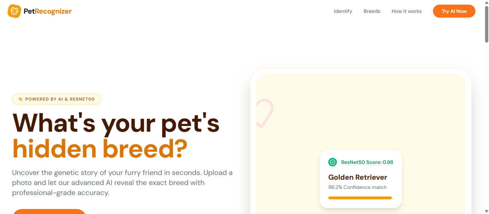
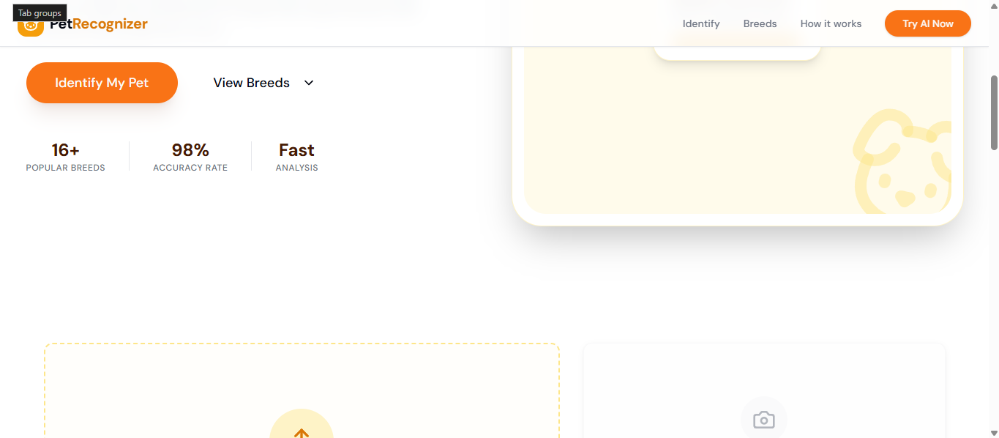
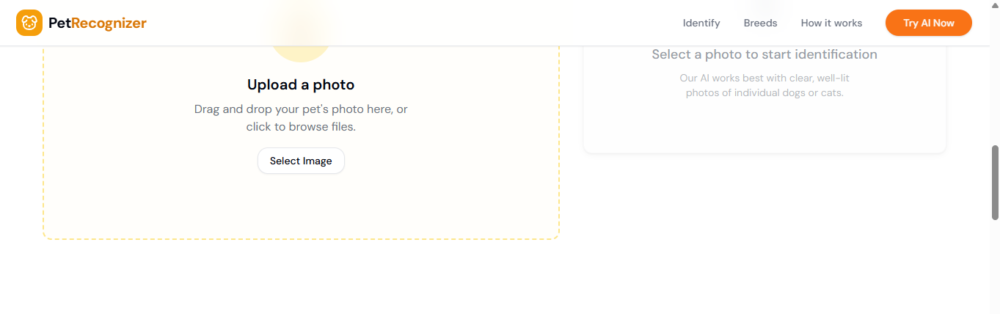
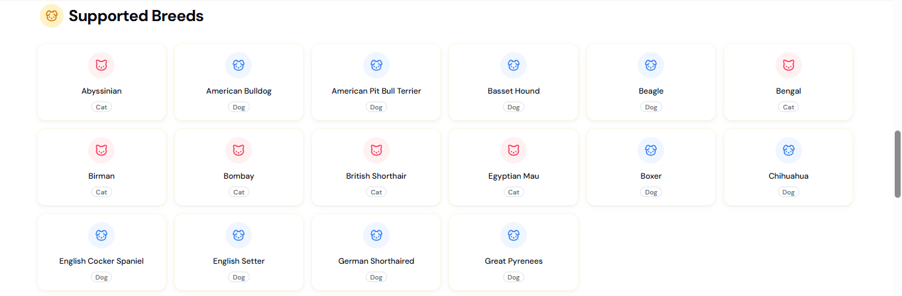
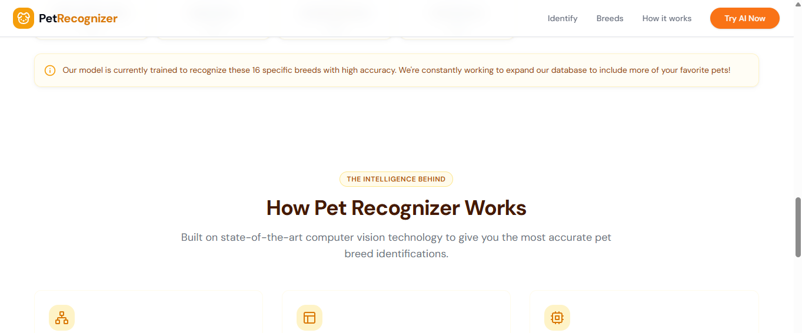
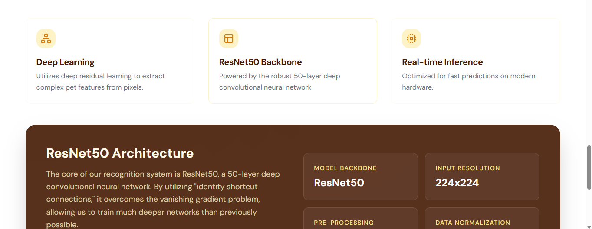
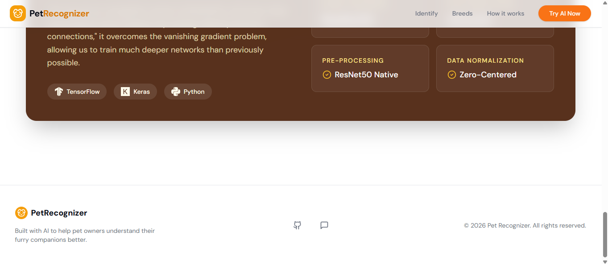

# Pet_Face_Recognition_Machine_learning_model
I wanted to share an update that I’ve recently created a new GitHub repository titled Pet_Face_Recognition_Machine_learning_model, which focuses on a machine learning model for pet face recognition.

# 🐶🐱 Pet Face Recognition Machine Learning Model

A Machine Learning project that detects and recognizes pet faces (dogs/cats) using image classification techniques. The goal is to build an accurate and lightweight model that can identify pets from images and potentially scale to multi-breed or multi-animal recognition systems.

[](https://landmarkai.nexttoken.app/)
## 🌐 Live Demo

A working web version of this project has been deployed for real-time inference.

🔗 **Try it live here:** https://petrecognizer.nexttoken.app

### 🧪 Features in Live App:
- Upload pet images for instant prediction
- Real-time model inference
- Simple and interactive UI for testing results

## 📷 Demo









## 📌 Project Overview

This project focuses on building a pet face recognition system using deep learning / machine learning techniques. It can be used for:

- Identifying pets from images
- Pet monitoring systems
- Smart pet applications
- Research in animal facial recognition

---

## 🚀 Features

- Pet face detection from images
- Image preprocessing and augmentation
- CNN-based classification model
- Training and evaluation pipeline
- Prediction on custom images
- Modular and easy-to-extend codebase

---

## 🧠 Tech Stack

- Python 🐍
- TensorFlow / Keras / PyTorch (choose based on your implementation)
- OpenCV for image processing
- NumPy & Pandas
- Matplotlib / Seaborn for visualization
- Jupyter Notebook (for experimentation)

---

## 📊 Dataset

The model is trained on a dataset containing labeled images of pets (dogs and cats).  
You can use datasets such as:

- Kaggle Dogs vs Cats dataset
- Custom labeled pet face dataset

> You can replace this section with your actual dataset details.

---

## ⚙️ Installation

Clone the repository:

```bash
git clone https://github.com/your-username/Pet_Face_Recognition_Machine_learning_model.git
cd Pet_Face_Recognition_Machine_learning_model
pip install -r requirements.txt
python train.py
```

📈 Model Architecture

The project uses a Convolutional Neural Network (CNN) consisting of:

Convolution layers for feature extraction
MaxPooling layers for dimensionality reduction
Fully connected dense layers for classification
Softmax/Sigmoid output layer depending on number of classes


🧪 Results


Loss optimized using: Adam optimizer
Evaluation metrics: Accuracy, Precision, Recall

Replace with your actual results after training.
python predict.py --image path/to/image.jpg


🔮 Future Improvements


Expand dataset to multiple pet breeds
Improve model accuracy with transfer learning (ResNet / EfficientNet)
Deploy as a web app using Flask or Streamlit
Real-time pet detection using webcam
Mobile app integration


🤝 Contribution

Contributions are welcome!

Fork the repo
Create a new branch
Commit changes
Submit a pull request

📜 License

This project is open-source and available under the MIT License.

📫 Contact

Harsh Gautam 📧 hg699810@gmail.com

🔗 https://github.com/HarshGautam0
